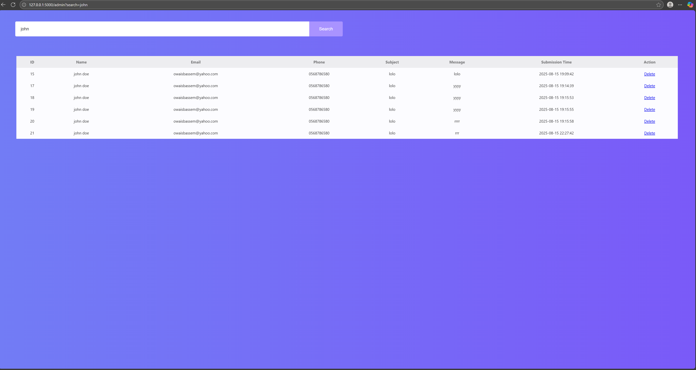

Contact Messaging (CM) System

Its a web based contact messaging system using python Flask, MySQL, JavaScript, and CSS, which offers site visitors a convenient way to 
contact by dropping messages then the admin can see them from his site. originally
This was during a university course (Web development) to train on the building blocks of web development, in terms of dynamic content, client-side validation,
and database integration. it was with PHP instead of flask.

features:

User Message Form: Include your name, email, phone, subject and message.

Client-side validation / JavaScript This is the validation that runs on the client and verifies your input prior to hitting submit.

Database Storage: The messages are stored safely as a MySQL database with timestamps.

Admin Panel: The admin will be able to see messages the way in a nice table and sort or filter the messages either by name, subject or date of submission.

Message Management: The administration is free to remove messages.

Arabic Language Support: The system operates on English and on Arabic.

Screenshots:

English Version:-
.png)
.png)

Admin Page:-

Arabic Version:-
.png)
.png)

